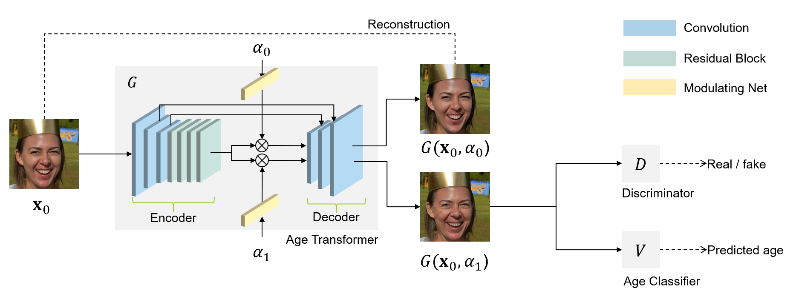

## HRFAE: High Resolution Face Age Editing

Official implementation for paper [High Resolution Face Age Editing](https://arxiv.org/pdf/2005.04410.pdf).



## Dependencies

* Python 3.7
* Pytorch 1.1
* Numpy
* Opencv
* TensorboardX
* Tensorboard_logger

You can also create a new environment for this repo by running
```
conda env create -f env.yml
```

## Load and test pretrained network 

1. You can download the pretrained model by running:
    ```
    cd ./logs/001
    ./download.sh
    ```

2. Upload test images in the folder `/test/input` and run the test file. The output images will be saved in the folder `/test/output`. You can change the desired target age with `--target_age`.
    ```
    python test.py --config 001 --target_age 65
    ```

## Train a new model

1. Pretrained age classifier

    To get age information, we use an age classifier pretrained on [IMDB-WIKI](https://data.vision.ee.ethz.ch/cvl/rrothe/imdb-wiki/) dataset. We use the model released from paper [Deep expectation of real and apparent age from a single image without facial landmarks](https://data.vision.ee.ethz.ch/cvl/publications/papers/articles/eth_biwi_01299.pdf) by Rothe et al. 

    To prepare the model, you need to download the original [caffe model](https://data.vision.ee.ethz.ch/cvl/rrothe/imdb-wiki/static/dex_imdb_wiki.caffemodel) and convert it to PyTorch format. We use the converter [caffemodel2pytorch](https://github.com/vadimkantorov/caffemodel2pytorch) released by Vadim Kantorov. Then name the PyTorch model as `dex_imdb_wiki.caffemodel.pt` and put it in the folder `/models`.


2. Preparing your dataset

    Download [FFHQ](https://github.com/NVlabs/ffhq-dataset) dataset and unzip it to the `/data/ffhq` directory. 
    
    Download [age label](https://partage.imt.fr/index.php/s/DbSk4HzFkeCYXDt) to the `/data` directory.

    You can also train the model with your own dataset. Put your images in the `/data` directory. With the pretrained classifier, you can create a new label file with the age of each image. 

3. Training
    
    You can modify the training options of the config file in `configs` directory.
    ```
    python train.py --config 001 
    ```

## Google Colab

We also provide a colab version for quick test. To run it using Google Colab, please click [here](https://colab.research.google.com/github/InterDigitalInc/HRFAE/blob/master/test.ipynb). 

## Citation
```
@article{yao2020high,
    title   = {High Resolution Face Age Editing},
    author  = {Xu Yao and Gilles Puy and Alasdair Newson and Yann Gousseau and Pierre Hellier},
    journal = {CoRR},
    volume  = {abs/2005.04410},
    year    = {2020},
}
```
## License

Copyright © 2020, InterDigital R&D France. All rights reserved.

This source code is made available under the license found in the LICENSE.txt in the root directory of this source tree.


